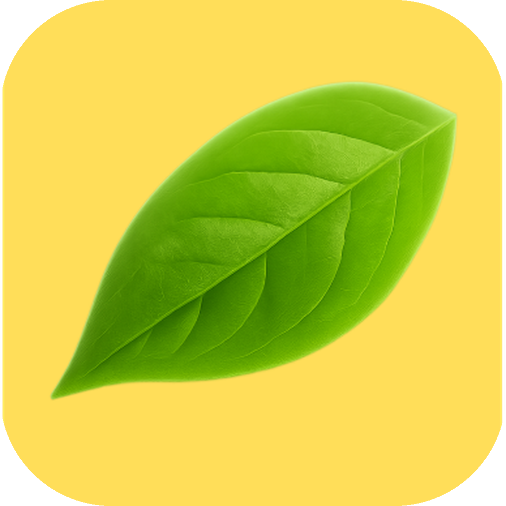

<p align="center">
  
</p>

<h1 align="center">Prune</h1>

<p align="center">
  <strong>Reclaim disk space by finding and deleting <code>node_modules</code></strong>
</p>

<p align="center">
  <a href="https://github.com/mk24x7/prune/releases/latest"></a>
  
  
  
  <a href="https://github.com/mk24x7/prune/blob/main/LICENSE"></a>
</p>

---

A native macOS app that scans your filesystem for `node_modules` directories, shows how much space each one occupies, and lets you selectively delete them. Built with SwiftUI -- no Electron, no web runtime. The entire app is under 2 MB.

## Screenshots

> *Coming soon*

## Download

Grab the latest release from the [Releases page](https://github.com/mk24x7/prune/releases/latest):

| Asset | Description |
|-------|-------------|
| **Prune.dmg** | Disk image -- mount, drag to Applications |
| **Prune-app.zip** | Zipped app bundle -- unzip and run |

### First launch

The app is ad-hoc signed (no Apple Developer certificate). On first launch, macOS will block it:

1. Open **System Settings** > **Privacy & Security**
2. Scroll down and click **Open Anyway** next to the Prune message
3. Subsequent launches will work normally

## Features

- Scan any directory (defaults to home directory)
- Smart scanning -- skips `.Trash`, `Library`, `.git`, IDE caches, and other unproductive paths
- Shows project name, size, full path, and last modified age
- Color-coded size badges (red > 500 MB, orange > 100 MB, green otherwise)
- Sort by size, name, age, or path
- Select all / deselect all with one click
- Confirmation dialog before deletion
- Per-item progress and status during deletion
- Summary with total space freed

## Build from source

Requires Swift 5.9+ and macOS 13+.

```bash
git clone https://github.com/mk24x7/prune.git
cd prune

# Build and assemble .app bundle
./build.sh

# Optional: create DMG
./dmg.sh
```

The built `Prune.app` will be in the project root.

## CLI

A Node.js command-line version is included in the `cli/` directory for terminal users:

```bash
cd cli
npm install
node node-cleanup.js [directory]
```

Requires Node.js 18+. Features interactive checkboxes, colored output, and spinner animations.

## How it works

1. **Scan** -- Iterative depth-first search (max depth 8) using `FileManager.contentsOfDirectory`. Skips known unproductive directories. Does not recurse into found `node_modules` (avoids nested duplicates).
2. **Size** -- Shells out to `du -sk` for fast, accurate size calculation. Reads `package.json` for project names.
3. **Delete** -- Uses `FileManager.removeItem` for deletion. Reports per-item success/failure.

## Project structure

```
prune/
  Package.swift          # Swift Package Manager config
  Sources/               # SwiftUI app (12 files)
    PruneApp.swift       # App entry point
    AppState.swift       # Observable state machine
    Scanner.swift        # Actor-based filesystem scanner
    Sizer.swift          # Size calculation + formatting
    Deleter.swift        # Directory deletion
    Models.swift         # Data types and enums
    ContentView.swift    # Phase-based view routing
    LandingView.swift    # Directory picker + scan trigger
    ScanningView.swift   # Scan progress display
    ResultsView.swift    # Results list with toolbar + footer
    DeletingView.swift   # Deletion progress
    SummaryView.swift    # Completion summary
  cli/                   # Node.js CLI tool
    node-cleanup.js      # CLI entry point
    lib/                 # Scanner, sizer, deleter, UI modules
  build.sh               # Build + assemble .app bundle
  dmg.sh                 # Create DMG installer
  Info.plist             # App metadata
  AppIcon.icns           # App icon
```

## License

MIT
