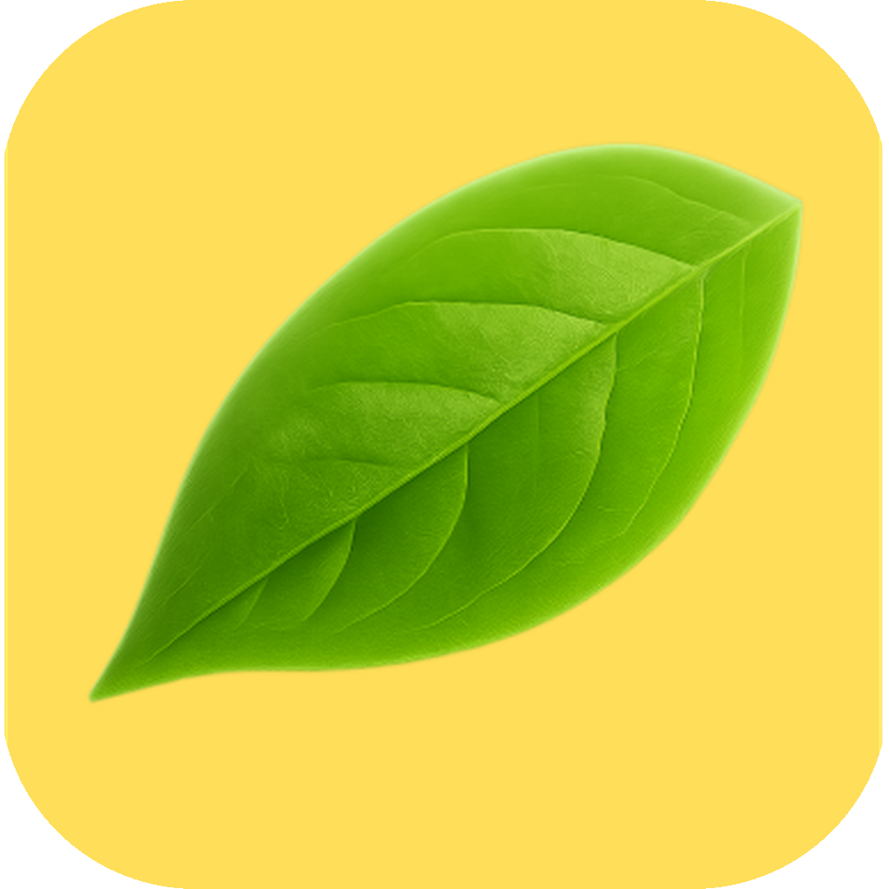
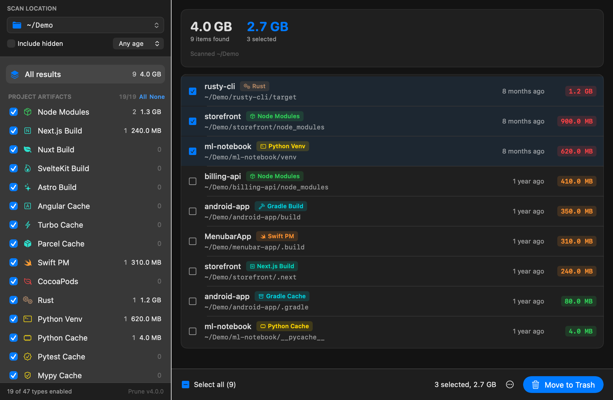

<p align="center">
  
</p>

<h1 align="center">Prune</h1>

<p align="center">
  <strong>Find and safely remove the gigabytes your toolchains left behind.</strong>
</p>

<p align="center">
  <a href="https://github.com/mk24x7/prune/releases/latest"></a>
  <a href="https://github.com/mk24x7/prune/actions/workflows/ci.yml"></a>
  <a href="https://www.npmjs.com/package/prune-cli"></a>
  
  <a href="LICENSE"></a>
</p>

---

Prune is a native macOS app, with a companion CLI, that scans for regenerable developer
artifacts and caches, shows what each one costs you in disk space, and moves the ones
you pick to the Trash. It knows 47 artifact types across Node, Rust, Swift, Python,
Gradle, Android and Xcode, plus the system caches that other tools ignore: DerivedData,
Homebrew, pnpm, Go modules, Playwright browsers, Android system images and more.

SwiftUI, no Electron, no web runtime, no network access, no telemetry. The app is
under 3 MB.

<p align="center">
  
</p>

## Install

Prune is open source and signed with an ad-hoc signature, not an Apple Developer ID.
Pick the install path that suits you.

**1. Homebrew, built from source (no Gatekeeper prompt)**

```bash
brew install mk24x7/tap/prune
ln -sfn "$(brew --prefix prune)/Prune.app" /Applications/Prune.app
```

The app is compiled on your Mac, so it carries no quarantine flag and opens without any
security dialog. Needs Xcode 15 or later.

**2. Direct download**

Download `Prune-<version>-macos-universal.dmg` or `.zip` from the
[latest release](https://github.com/mk24x7/prune/releases/latest), verify it against
`SHA256SUMS.txt`, and copy `Prune.app` to `/Applications`. Then either:

- open it once, click **Done** in the "Apple could not verify" dialog, go to
  **System Settings > Privacy & Security**, scroll to **Security** and click
  **Open Anyway** (macOS 15 and 26 no longer offer the Control-click shortcut), or
- clear the quarantine flag from Terminal:

```bash
xattr -d com.apple.quarantine /Applications/Prune.app
```

**3. Homebrew cask (prebuilt, quarantined)**

```bash
brew install --cask mk24x7/tap/prune-app
```

Homebrew no longer strips quarantine, so this path shows the same first-launch dialog
as the direct download. Use it if you manage your Mac with `brew bundle`.

**4. Build from source**

```bash
git clone https://github.com/mk24x7/prune.git && cd prune
./build.sh          # builds dist/Prune.app, ad-hoc signed
./package.sh        # optional: zip, dmg and checksums
```

**5. Command line**

```bash
npx prune-cli --all --dry-run       # preview without installing
npm install -g prune-cli            # or: brew install mk24x7/tap/prune-cli
prune --categories node --min-age 90 --yes
```

## What it finds

Detection rules live in one file, [`Definitions/artifacts.json`](Definitions/artifacts.json),
shared by the app and the CLI. Types marked "no" under Regenerable hold data you cannot
get back (Xcode archives, emulator devices, iPhone backups); they are off by default and
Prune warns before touching them. To request a type, open an
[artifact type request](https://github.com/mk24x7/prune/issues/new?template=artifact_type_request.yml).

<!-- artifact-tables:start -->
### Project-level

| Category | What it finds | How it detects |
| --- | --- | --- |
| Node Modules (`node`) | `node_modules` | always |
| Next.js Build (`next`) | `.next` | next to any of `next.config.js`, `next.config.mjs`, `next.config.ts`, `package.json` |
| Nuxt Build (`nuxt`) | `.nuxt`, `.output` | next to any of `nuxt.config.js`, `nuxt.config.ts`, `nuxt.config.mjs` |
| SvelteKit Build (`sveltekit`) | `.svelte-kit` | next to any of `svelte.config.js`, `svelte.config.mjs`, `svelte.config.ts` |
| Astro Build (`astro`) | `.astro` | next to any of `astro.config.mjs`, `astro.config.js`, `astro.config.ts` |
| Angular Cache (`angular`) | `.angular` | next to any of `angular.json` |
| Turbo Cache (`turbo`) | `.turbo` | next to any of `turbo.json`, `package.json` |
| Parcel Cache (`parcel`) | `.parcel-cache` | next to any of `package.json` |
| Swift PM (`swiftpm`) | `.build` | next to any of `Package.swift` |
| CocoaPods (`cocoapods`) | `Pods` | next to any of `Podfile` |
| Rust (`rust`) | `target` | next to any of `Cargo.toml` |
| Python Venv (`pythonvenv`) | `venv`, `.venv` | next to any of `requirements.txt`, `pyproject.toml`, `setup.py`, `setup.cfg`, `Pipfile` |
| Python Cache (`pycache`) | `__pycache__` | always |
| Pytest Cache (`pytestcache`) | `.pytest_cache` | always |
| Mypy Cache (`mypycache`) | `.mypy_cache` | always |
| Ruff Cache (`ruffcache`) | `.ruff_cache` | always |
| Tox Cache (`tox`) | `.tox` | next to any of `tox.ini`, `pyproject.toml` |
| Gradle Build (`gradle`) | `build` | next to any of `build.gradle`, `build.gradle.kts` |
| Gradle Cache (`gradlecache`) | `.gradle` | next to any of `build.gradle`, `build.gradle.kts`, `settings.gradle`, `settings.gradle.kts` |

### System-level

| Category | Path | Default | Regenerable |
| --- | --- | --- | --- |
| Xcode DerivedData (`xcode-derived`) | `~/Library/Developer/Xcode/DerivedData` (each subfolder) | on | yes |
| Xcode Archives (`xcode-archives`) | `~/Library/Developer/Xcode/Archives` (each subfolder) | off | no |
| Xcode Device Support (`xcode-device-support`) | `~/Library/Developer/Xcode/iOS DeviceSupport` (each subfolder) | on | yes |
| Xcode Cache (`xcode-cache`) | `~/Library/Caches/com.apple.dt.Xcode` | on | yes |
| Gradle Global Cache (`gradle-global`) | `~/.gradle/caches`, or `$GRADLE_USER_HOME/caches` | on | yes |
| Homebrew Cache (`homebrew-cache`) | `~/Library/Caches/Homebrew`, or `$HOMEBREW_CACHE` | on | yes |
| npm Cache (`npm-cache`) | `~/.npm`, or `$npm_config_cache` | on | yes |
| Yarn Cache (`yarn-cache`) | `~/Library/Caches/Yarn`, or `$YARN_CACHE_FOLDER` | on | yes |
| pnpm Store (`pnpm-store`) | `~/Library/pnpm/store`, or `$npm_config_store_dir` | on | yes |
| Bun Cache (`bun-cache`) | `~/.bun/install/cache`, or `$BUN_INSTALL/install/cache` | on | yes |
| pip Cache (`pip-cache`) | `~/Library/Caches/pip`, or `$PIP_CACHE_DIR` | on | yes |
| Cargo Registry Cache (`cargo-registry`) | `~/.cargo/registry`, or `$CARGO_HOME/registry` | on | yes |
| Go Module Cache (`go-mod-cache`) | `~/go/pkg/mod`, or `$GOMODCACHE`, `$GOPATH/pkg/mod` | on | yes |
| Puppeteer Cache (`puppeteer-cache`) | `~/.cache/puppeteer`, or `$PUPPETEER_CACHE_DIR` | on | yes |
| Playwright Browsers (`playwright-cache`) | `~/Library/Caches/ms-playwright`, or `$PLAYWRIGHT_BROWSERS_PATH` | on | yes |
| Electron Cache (`electron-cache`) | `~/Library/Caches/electron`, or `$ELECTRON_CACHE` | on | yes |
| Android System Images (`android-system-images`) | `~/Library/Android/sdk/system-images` (each subfolder), or `$ANDROID_HOME/system-images`, `$ANDROID_SDK_ROOT/system-images` | on | yes |
| Android Virtual Devices (`android-avd`) | `~/.android/avd` (each subfolder) | off | no |
| Gradle Wrapper Distributions (`gradle-wrapper-dists`) | `~/.gradle/wrapper/dists` (each subfolder), or `$GRADLE_USER_HOME/wrapper/dists` | on | yes |
| Simulator Caches (`coresimulator-caches`) | `~/Library/Developer/CoreSimulator/Caches` | on | yes |
| iOS Device Backups (`ios-device-backups`) | `~/Library/Application Support/MobileSync/Backup` (each subfolder) | off | no |
| Docker Disk Image (`docker-disk-image`) | `~/Library/Containers/com.docker.docker/Data/vms/0/data/Docker.raw` | off | yes |
| Go Build Cache (`go-build-cache`) | `~/Library/Caches/go-build`, or `$GOCACHE` | on | yes |
| SwiftPM Cache (`swiftpm-cache`) | `~/Library/Caches/org.swift.swiftpm` | on | yes |
| pnpm Cache (`pnpm-cache`) | `~/Library/Caches/pnpm` | on | yes |
| node-gyp Cache (`node-gyp-cache`) | `~/Library/Caches/node-gyp` | on | yes |
| Cypress Cache (`cypress-cache`) | `~/Library/Caches/Cypress`, or `$CYPRESS_CACHE_FOLDER` | on | yes |

### Other

| Category | What it finds | Default | Regenerable |
| --- | --- | --- | --- |
| Downloaded Installers (`downloads-installers`) | `.dmg`, `.pkg` files in `~/Downloads` | off | yes |
<!-- artifact-tables:end -->

## Safety

Prune deletes things for a living, so it is built to be boring about it.

- **Trash by default.** Items go to the Trash through the same API Finder uses, so
  "Put Back" works. Permanent deletion is a separate button, never the default.
- **Sibling-file detection.** `target/` is only Rust if `Cargo.toml` sits next to it;
  `build/` is only Gradle next to a `build.gradle`. Names alone never qualify.
- **Re-verified at deletion time.** Right before each removal Prune checks again that
  the path is a real directory (never a symlink), still under the folder you scanned,
  still has its marker file, and still matches the type you selected. Anything that
  fails is skipped and logged.
- **Never follows symlinks, never enters app bundles or `.git`.**
- **Dry run in the CLI** (`--dry-run`, `--json`) shows exactly what would be removed
  without prompting for anything.
- **Deletion log** at `~/Library/Logs/Prune/deletions.jsonl`, one line per item and per
  run, so you can always see what happened.
- **Honest numbers.** Sizes are estimates from `du`; single files use allocated size.
  After a permanent delete Prune measures the volume before and after and reports the
  real figure next to the estimate.
- **Minimum age filter** so anything you touched in the last 7, 30, 90 or 180 days is
  left alone.
- **No network, no analytics, no background process.** It runs when you open it.

## Compared with

| | Prune | npkill | kondo | DevCleaner for Xcode |
|---|---|---|---|---|
| Interface | Native macOS app + CLI | Terminal | Terminal | Native macOS app |
| Platforms | macOS 13+ (CLI also runs on Linux for project artifacts) | macOS, Linux, Windows | macOS, Linux, Windows | macOS |
| Project artifacts | 19 types across JS, Rust, Swift, Python, Gradle | `node_modules` only | About 15 ecosystems | none |
| System caches | 27 (Xcode, Homebrew, npm, pnpm, Go, Cargo, Android, Playwright...) | none | none | Xcode only |
| Deletes to Trash | yes, default | no | no | no |
| Re-verifies before delete | yes | no | no | n/a |
| Distribution | Homebrew tap, DMG, npm | npm | cargo, Homebrew, AUR | Mac App Store |

npkill and kondo are excellent if you want one cross-platform terminal tool. Prune exists
for people who want a Mac app that also handles the caches under `~/Library`.

## CLI reference

```
prune [path] [options]

Selection:
  --categories <list>     Comma-separated type ids (see --list-categories)
  --all                   Every type, including ones that are not regenerable
  --list-categories       Show all type ids and exit
  --include-hidden        Also descend into hidden directories
  --max-depth <n>         Maximum directory depth below path
  --min-age <days>        Only items not modified in the last <days> days
  --min-size <n[KB|MB|GB]> Only items at least this large

Deletion:
  --dry-run               Scan and list only; never prompts, never deletes
  --permanent             Delete permanently instead of moving to the Trash
  -y, --yes               Select every item found and skip prompts
                          (requires --categories or --all)

Output:
  --json                  One JSON document on stdout; implies --dry-run unless --yes
  --no-color              Disable colors (NO_COLOR is also honoured)
  --log-dir <path>        Deletion log directory (default ~/Library/Logs/Prune)
  -h, --help              Show help
  -V, --version           Show the version

Exit codes: 0 success, 1 runtime error, 2 usage error, 3 some items could not be removed
```

## FAQ

**Why the Gatekeeper dialog?** Prune is not notarized because it is a free, open-source
side project and Apple's Developer Program costs 99 USD a year. The Homebrew formula
avoids the dialog entirely by compiling on your machine. If you would like to sponsor
notarization, open a discussion.

**Do I need Full Disk Access?** No. Prune only reads folders you point it at. macOS asks
once per protected folder (Desktop, Documents, Downloads). Caches under `~/Library` need
no extra permission, except iPhone backups, which macOS protects and Prune reports as
"could not be read".

**Why do pnpm projects look small?** pnpm hard-links every package into a global store,
so a project's `node_modules` shares its blocks with the store. `du` counts shared
blocks once per run, so per-project sizes understate what you would reclaim and the
pnpm store entry shows the real total.

**Why are Xcode Archives, Android devices and iPhone backups off by default?** They
are not regenerable. Archives hold the dSYMs you need to symbolicate crash logs from
shipped builds; the others hold user data.

**The Go module cache failed to delete.** Go marks that tree read-only. Prune's
permanent mode fixes the permissions and retries; Trash mode only needs to rename the
top folder, so it is unaffected.

**Does it respect `GOMODCACHE`, `CARGO_HOME` and friends?** Yes, when the variable is
set in the environment Prune runs in. An app launched from Finder does not see your
shell exports; the CLI does.

## How it works

1. **Scan.** An iterative depth-first walk (default depth 10) over the folder you pick,
   skipping `~/Library`, `.git`, app bundles and known cache roots. System caches are
   checked at their fixed locations, honouring environment overrides.
2. **Size.** `du -sk` per item, six at a time, with project names read from
   `package.json`, `Cargo.toml`, `Package.swift` or `settings.gradle`.
3. **Delete.** Verify, then `trashItem` (or `removeItem` on request), then log.

## Contributing

See [CONTRIBUTING.md](CONTRIBUTING.md). Adding an artifact type is one JSON entry, one
test fixture and a regenerated table. Security issues: [SECURITY.md](SECURITY.md).

## License

[MIT](LICENSE)
